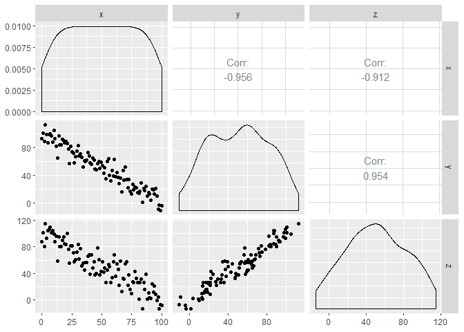

Lab meeting tangent
================

**How to deal with "Pipe" confounds statistically, and how best to communicate direct and indirect effects?**

Often we are interested in the indirect effect of some process or environmental variable (X) on a measured outcome (Z), where we also have data on some intermediate effect (Y). Another way to say this is that the effect of X on Z is mediated by Y.


A common example of this in the great(er) Safford lab is when we have data on burn severity (x), overstory structure (y), and a measure of biodiversity (z). We suspect that fire severity influences biodiversity *because* it changes overstory structure, but we want to know what the disturbance effect is rather than, or in addition to, the the change in structure.

Normally we don't know the causal mechanism for sure, but we can make up data here to force such a causal relationship (with a little bit of noise added for good measure).

Let's say that x is burn severity, y is canopy cover, and z is the abundance rate of the Hermit Warbler (a late-seral species). We've decided that burn severity reduces basal area `b1 = -1`, and that the warblers like areas with high basal area `b2 = 1`.




We can run simple linear models and return the parameters we defined. I've added some randomness so it's not perfect, but very close.

``` r
m1 <- lm(y ~ x, d)
precis(m1)
```

    ##               Mean StdDev  5.5%  94.5%
    ## (Intercept) 101.31   1.79 98.45 104.18
    ## x            -1.00   0.03 -1.05  -0.95

``` r
m2 <- lm(z ~ y, d)
precis(m2)
```

    ##             Mean StdDev  5.5% 94.5%
    ## (Intercept) 0.00   1.87 -2.99  2.99
    ## y           0.99   0.03  0.94  1.04


Straight forward enough. But of course our main question here is how does fire severity affect warber abundance. We could fit this as a bivariate regression `m3: z ~ x`, or we may want to also include canopy cover, because of course we know this matters `m4: z ~ y + x`. Our expectation is that burn severity has a negative effect of warblers because they like dense forests that haven't burned. We see this result from these two models:

    ##               Mean StdDev  5.5%  94.5%
    ## (Intercept) 100.53   2.62 96.35 104.72
    ## x            -1.00   0.05 -1.07  -0.92


    ##              Mean StdDev   5.5% 94.5%
    ## (Intercept) -0.71  11.13 -18.51 17.08
    ## y            1.00   0.11   0.83  1.17
    ## x            0.01   0.11  -0.17  0.19


What happened in the multivariate model with both burn severity (x) and canopy cover (y)!? The effect of burn severity dissapeared. I've recently heard this called a "pipe" confound, or "post-treatment bias". Basically when you condition on canopy cover, it "blocks the pipe" to burn severity. Or put another way, once the model knows the relationship between the direct effect of canopy cover and warbler abundance, there is nothing left for it to learn from the indirect effect of burn severity.

This can be really problematic when trying to infer causal relationships, and it isn't always so obvious as this so we might not realize something has gone wrong and move forward with the wrong interpretation of the model.

Of course, sometimes you need to include covariates, and omitting certain variables can lead to other types of counfounds. This can happen when a covariate influences both the effect of interest and the outcome. For example, elevation (a) influences both canopy cover (y) and hermit warbler abundance (z). In this case, you want to condition (model) on elevation in order to get an unbiased estiamte of the effect of canopy cover on warblers.


So how to deal with the pipe confound?

-   Analytical approaches
    -   Omit confounding variable(s)
    -   PCA-type approaches
    -   Structural equation models?
-   Explaining this a reviewer that says you *have to include canopy cover!*

More on different types of confounds: <https://www.youtube.com/watch?v=l_7yIUqWBmE>
