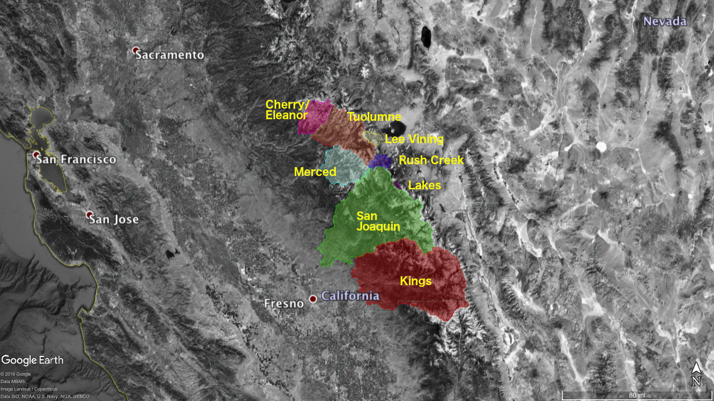
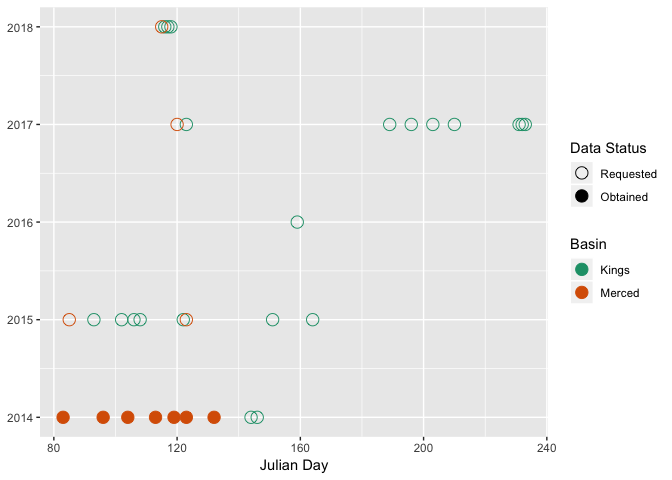

SnowFire Update 2
================
Zack Steel
2019-04-22

Overview
========

This document is meant to serve as an update/check-in for the "Snow Fire" project, as well as just a way for me to organize my thoughts. Previously I was approaching this project using the more available 50m resolution snow water equivalent data collected by ASO. However, I'm switching to a more fine-scale approach following feedback from others and some concerns about biased results using the coarser data.

At this point, this new approach is heavy on the thinking out loud and thought-organization, but in the future (and once we get all the data), I'll focus more summarizing analysis and results. Please let me know if you have any comments/suggests.

Motivation
==========

1.  Snow depth varies across forested areas, in part as a function of tree cover, which influences both snow interception and ablation. This likely varies both under canopy vs. in forest gaps, but also with gap internal distance from gap edge, and consequently with gap size and shape.

2.  Broad management strategies have resulted in differences in forest coverage and configuration across the region. Specifically, timber harvest history and fire suppression vs. managed wildfire, determine the size, shape and location of forest gaps (as well as the size and degree of shading of edge trees).

    1.  Fire regimes are changing with burns creating increasingly large forest gaps. Also fires at higher elevations are becoming more common.

    2.  In contrast to reference conditions, within fire-suppressed landscapes gaps are likely fewer and smaller where fire has been absent, and larger where recent fires have occurred.

3.  The climate is changing which affects both the magnitude of the snow pack at different elevations and timing of snow-melt. Also climate change is leading to higher densities of high-elevation forest.

4.  The amount of snow and the timing of its melt is important for a lot of things like life, almonds, and swimming pools.

Data Availability
=================

We are using Nasa's 3m lidar-derived [ASO data](https://nsidc.org/data/aso_3m_sd). Lidar fights have occurred starting in 2013, although they improved their equipment in 2014, so let's start that year. They have conducted flights across a number of basins, but we'll focus on the Merced and Kings basins since these have had the closest to natural fire regimes and likely most 'natural' distributions of gap types. If we want more temporal and/or spatial replication we could look at other basins, but we would need to wrangle a lot of data, and data requests haven't been rapid so far.

Currently we have data for 2014 from the Merced basin, and a request in for all other flights in the Merced and Kings basins.

Questions
=========

There are (at least) two ways to approach this analysis using 3m ASO data:

1.  At the gap level: How does gap size and shape influence mean snow depth and snow disappearance date? Could apply the SDC metric here as well.

2.  At the pixel level: How does snow depth and presence vary with distance to patch edge? Do pixels in shaded edges hold snow longer?

Either way we'd want to incorporate elevation, aspect, date, and snow-year to ask the follow if possible:

1.  Do this relationship depend upon climate (both inter-annual and across elevation)?

Relevant Literature
===================

There are clearly more than is listed below. If there are any important omissions at this point, please let me know.

-   Related to fire effects on forest gaps/patches: (Steel, Koontz, and Safford 2018; Stevens et al. 2017; Collins et al. 2017; Boisram’e et al. 2017)

-   Lidar measurements of snow depth: (A. A. Harpold et al. 2014; Painter et al. 2016)

-   Snow and tree cover: (Adrian A. Harpold et al. 2014; Currier and Lundquist 2018; Lundquist et al. 2013; Stevens 2017)

------------------------------------------------------------------------

Bibliography
============

Boisram’e, Gabrielle, Sally Thompson, Brandon Collins, and Scott Stephens. 2017. “Managed Wildfire Effects on Forest Resilience and Water in the Sierra Nevada.” *Ecosystems* 20 (4): 717–32. doi:[10.1007/s10021-016-0048-1](https://doi.org/10.1007/s10021-016-0048-1).

Collins, Brandon M., Jens T. Stevens, Jay D. Miller, Scott L. Stephens, Peter M. Brown, and Malcolm P. North. 2017. “Alternative Characterization of Forest Fire Regimes: Incorporating Spatial Patterns.” *Landscape Ecology* 32 (8): 1543–52. doi:[10.1007/s10980-017-0528-5](https://doi.org/10.1007/s10980-017-0528-5).

Currier, William Ryan, and Jessica D. Lundquist. 2018. “Snow Depth Variability at the Forest Edge in Multiple Climates in the Western United States.” *Water Resources Research* 54 (11): 8756–73. doi:[10.1029/2018WR022553](https://doi.org/10.1029/2018WR022553).

Harpold, A. A., Q. Guo, N. Molotch, P. D. Brooks, R. Bales, J. C. Fernandez-Diaz, K. N. Musselman, et al. 2014. “LiDAR-Derived Snowpack Data Sets from Mixed Conifer Forests Across the Western United States.” *Water Resources Research* 50 (3): 2749–55. doi:[10.1002/2013WR013935](https://doi.org/10.1002/2013WR013935).

Harpold, Adrian A., Joel A. Biederman, Katherine Condon, Manuel Merino, Yoganand Korgaonkar, Tongchao Nan, Lindsey L. Sloat, Morgan Ross, and Paul D. Brooks. 2014. “Changes in Snow Accumulation and Ablation Following the Las Conchas Forest Fire, New Mexico, USA.” *Ecohydrology* 7 (2): 440–52. doi:[10.1002/eco.1363](https://doi.org/10.1002/eco.1363).

Lundquist, Jessica D., Susan E. Dickerson-Lange, James A. Lutz, and Nicoleta C. Cristea. 2013. “Lower Forest Density Enhances Snow Retention in Regions with Warmer Winters: A Global Framework Developed from Plot-Scale Observations and Modeling.” *Water Resources Research* 49 (10): 6356–70. doi:[10.1002/wrcr.20504](https://doi.org/10.1002/wrcr.20504).

Painter, Thomas H., Daniel F. Berisford, Joseph W. Boardman, Kathryn J. Bormann, Jeffrey S. Deems, Frank Gehrke, Andrew Hedrick, et al. 2016. “The Airborne Snow Observatory: Fusion of Scanning Lidar, Imaging Spectrometer, and Physically-Based Modeling for Mapping Snow Water Equivalent and Snow Albedo.” *Remote Sensing of Environment* 184 (October): 139–52. doi:[10.1016/j.rse.2016.06.018](https://doi.org/10.1016/j.rse.2016.06.018).

Steel, Zachary L., Michael J. Koontz, and Hugh D. Safford. 2018. “The Changing Landscape of Wildfire: Burn Pattern Trends and Implications for California’s Yellow Pine and Mixed Conifer Forests.” *Landscape Ecology* 33 (7): 1159–76. doi:[10.1007/s10980-018-0665-5](https://doi.org/10.1007/s10980-018-0665-5).

Stevens, Jens T. 2017. “Scale-Dependent Effects of Post-Fire Canopy Cover on Snowpack Depth in Montane Coniferous Forests.” *Ecological Applications* 27 (6): 1888–1900. doi:[10.1002/eap.1575](https://doi.org/10.1002/eap.1575).

Stevens, Jens T., Brandon M. Collins, Jay D. Miller, Malcolm P. North, and Scott L. Stephens. 2017. “Changing Spatial Patterns of Stand-Replacing Fire in California Conifer Forests.” *Forest Ecology and Management* 406 (December): 28–36. doi:[10.1016/j.foreco.2017.08.051](https://doi.org/10.1016/j.foreco.2017.08.051).
